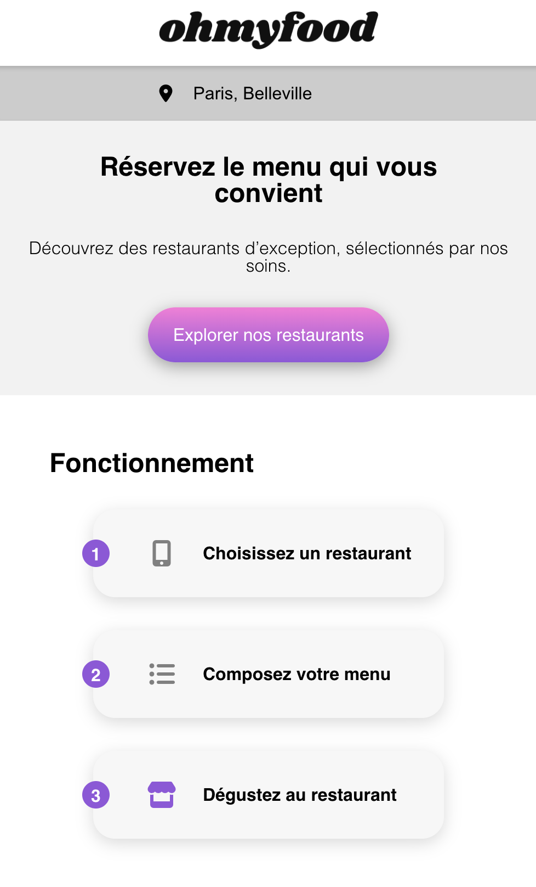

## Description

Oh My Food Paris est un site web qui vous permet de découvrir et de réserver des menus gastronomiques dans les
restaurants d'exception de Paris. Composez votre menu personnalisé et réduisez votre temps d'attente au restaurant grâce
à notre service en ligne.

## Table des matières

- [Aperçu](#aperçu)
- [Marque](#marque)
    - [Identité](#Identité)
    - [Proposition](#proposition)
    - [Positionnement](#positionnement)
- [Cible](#cible)
- [Identité graphique](#identité-graphique)
    - [Polices](#Polices)
    - [Couleurs](#Couleurs)
- [Fonctionnement](#fonctionnement)
- [Système d'exploitation](#système-dexploitation)
- [Technologies Utilisées](#technologies-utilisées)
- [IDE](#ide)
- [Compatibilité](#compatibilité)
- [Livrables](#livrables)
- [Effets graphiques](#effets-graphiques)
- [Installation](#installation)
    - [Installation de Sass](#installation-de-sass)

## Aperçu

Le site Oh My Food Paris est conçu pour répondre aux besoins des classes moyennes et supérieures qui recherchent une
expérience gastronomique de qualité tout en économisant du temps. Il propose une sélection de restaurants de renom à
Paris, avec des menus personnalisables.



## Marque

### Identité

Oh My Food est une entreprise de commande de repas en ligne qui offre aux utilisateurs la possibilité de composer leur
propre menu.

### Proposition

La proposition de la marque est de proposer les menus de restaurants gastronomiques, en commençant par Paris.

### Positionnement

La marque se positionne sur un marché de niche en mettant en avant des restaurants de luxe dans les villes où elle est
établie.

## Cible

Oh My Food Paris cible les classes moyennes et supérieures, connectées et pressées, qui souhaitent déguster des produits
de qualité.

## Identité graphique

### Polices

Shrikhand (Logo et titres), Roboto (Texte)

### Couleurs

- Primaire :  #9356DC
- Secondaire : #FF79DA
- Tertiaire :  #99E2D0

## Fonctionnement

- **Budget** : 20 000 €
- **Planning** : Date de livraison de la première version du site sous 1 mois.

### Système d'exploitation


### Technologies Utilisées


## IDE

### Visual Studio Code


- **Live Server**
- **Prettier**
- **Live Sass Compiler**
- **Live Share**
- **GitLens**

### Webstorm


- **Git**
- **Sass**
- **Prettier**
- **Live Edit**
- **Live Share**
- **Emmet**

## Compatibilité

Le site est compatible avec les dernières versions de Chrome et Firefox sur desktop. Il est également responsive sur
mobile, tablette et desktop.

## Livrables

- Page d'accueil avec localisation, présentation et menus.
- Pages de menu pour 4 restaurants.
- Footer et Header.

## Effets graphiques

Les effets graphiques incluent des animations au survol des boutons, un loader sur la page d'accueil et des animations
lors de la sélection de plats sur les pages de menu.

## Installation

Pour utiliser le site localement, vous pouvez cloner ce référentiel et ouvrir le fichier `index.html` dans votre
navigateur web.

```bash
git clone https://github.com/D-Sriver/Projet_3_OhMyFood_oc.git
```

### Installation de Sass

Installation de Sass :

Vous devez installer Sass pour travailler sur ce projet. Utilisez la commande suivante dans votre terminal pour
l'installer globalement :

```bash
npm -g install sass
```

Compilation automatique de SASS à CSS
Conversion automatique des fichiers SASS à CSS : Pour convertir automatiquement les fichiers SCSS à CSS, utilisez la
commande suivante dans votre terminal :

```bash 
npm run sas
```

